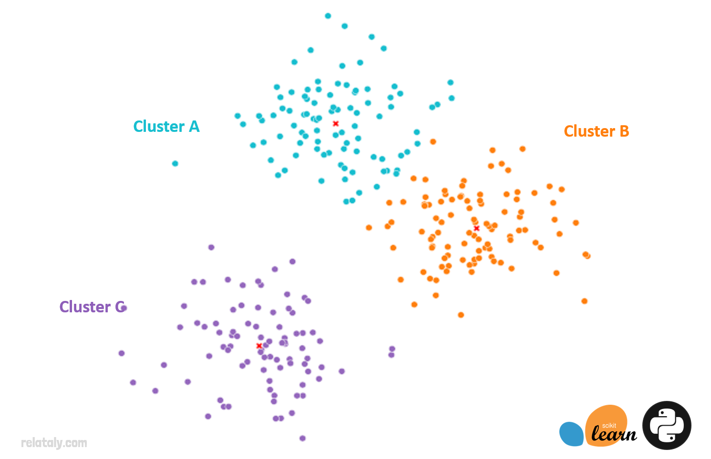

# Crypto Clustering with K-means
This project uses the unsupervised machine learning technique of clustering to cluster cryptocurrencies by their performance in different time periods. The time periods include the price change percentage for 24 hours, 7 days, 14 days, 30 days, 60 days, 200 days, and 1 year. There are 41 different coins included in the dataset. This project first applies the K-means algorithm using the original data, and then it optimizes the clusters using the Principal Component Analysis (PCA). A scatter plot of the clusters for the original data and the PCA data is created and analyzed.



---

## Technologies
This project uses Jupyter Notebook (within [JupyterLab](https://jupyterlab.readthedocs.io/en/stable/)) and the standard Python 3.8 libraries. In addition, this project requires the following libraries and/or dependencies:
* [pandas](https://pandas.pydata.org/) - a software library designed for open source data analysis and manipulation
* [hvplot](https://hvplot.holoviz.org/) - interactive plotting API that supports panning, zooming, hovering, and clickable/selectable legends
* [sklearn](https://scikit-learn.org/stable/) - simple and efficient tools for predictive data analysis; built on NumPy, SciPy, and matplotlib
* [Path](https://pypi.org/project/path/) - implements path objects as first-class entities, allowing common operations on files to be invoked on those path objects directly

Here is the code for the imports:
```
import pandas as pd
import hvplot.pandas
from path import Path
from sklearn.cluster import KMeans
from sklearn.decomposition import PCA
from sklearn.preprocessing import StandardScaler
```

---

## Installation Guide
Before running the application, first install the following dependencies:
```
Install Anaconda Package
Pip install Jupyter
pip install -U scikit-learn
conda install -c pyviz hvplot 
```

Verify the installations:
```
conda list scikit-learn
conda list hvplot
```

---

## Usage
To interact with the project of the cryptocurrency clusters with K-means:
1. Clone the repository 
`git clone https://github.com/ccroft6/Crypto_Clustering_KMeans.git`

2. Open terminal at this repository location. Activate the environment and launch jupyter lab:

```
conda activate dev
jupyter lab 
```
*Jupyter lab should launch in a web browser. If it doesn't launch, select one of the hyperlinks that it provides, copy it, and paste it into a web browser.* 

---

## Methods
The following steps were taken for this analysis:
1. Import the Data 
2. Prepare the Data
3. Find the Best Value for k Using the Original Data
4. Cluster Cryptocurrencies with K-means Using the Original Data
5. Optimize Clusters with Principal Component Analysis
6. Find the Best Value for k Using the PCA Data
7. Cluster the Cryptocurrencies with K-means Using the PCA Data
8. Visualize and Compare the Results

---

## Contributors
Catherine Croft

Email: catherinecroft1014@gmail.com

LinkedIn: [catherine-croft](https://www.linkedin.com/in/catherine-croft-4715481aa/)

---

## License 
MIT